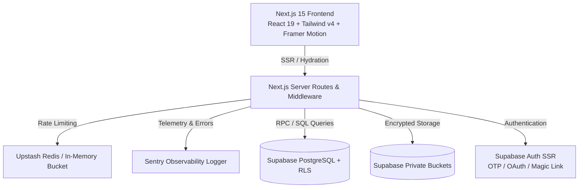

# 🛍️ Rakexura Store

<div align="center">


### **Next-Generation Digital PC Gaming & Subscription Marketplace**
*High-performance, cinematic e-commerce platform built with Next.js 15, React 19, TypeScript, Tailwind CSS v4, and Supabase.*

[](https://nextjs.org/)
[](https://react.dev/)
[](https://www.typescriptlang.org/)
[](https://tailwindcss.com/)
[](https://supabase.com/)
[](https://sentry.io/)
[](https://vercel.com/)

[Explore Features](#-key-features) • [Quickstart](#-local-development) • [Architecture](#-architecture--tech-stack) • [Database Setup](#-database--migrations) • [Security](#-security--anti-fraud)

</div>

---

## 📖 Overview

**Rakexura Store** is a digital gaming commerce platform tailored for PC gamers. It delivers authentic PC game licenses (Steam, Epic Games, Rockstar, Ubisoft, EA) and cloud gaming subscriptions (Xbox Game Pass Ultimate, Nvidia GeForce NOW) with transparent INR pricing, frictionless UPI checkout, automated order tracking, and instant delivery verification.

Built on **Next.js 15 App Router** and **Supabase SSR**, Rakexura Store combines a cinematic dark gaming aesthetic with enterprise-grade security, rate-limited APIs, real-time database channels, and an intuitive administrative command center.

---

## ✨ Key Features

### 🎮 Cinematic Storefront & Discovery
* **Interactive Hero & Marquee:** Spotlights trending releases, curated bundles, and flash deals with smooth hardware-accelerated transitions.
* **Smart Catalog & Dynamic Filters:** Instant client-side search with platform filtering (Steam, Epic Games, Rockstar), genre categories, price range sorting, and badge indicators (*Featured Deal*, *Best Seller*, *Flash Offer*).
* **Live Offer Countdown Timers:** Synchronized real-time countdown clocks for limited-time price drops and weekend events.

### ⚡ Game Editions & Multi-Tier Subscriptions
* **Flexible Game Variants:** Granular pricing and delivery instructions for **Steam Accounts**, **Epic Accounts**, and **Offline Activation**.
* **Subscription Duration Tiers:** Seamless support for cloud gaming services (Xbox Game Pass, Nvidia GeForce NOW) with separate **1 Month**, **2 Months**, and **3 Months** duration plans.

### 💳 Instant UPI Checkout & Order Verification
* **Dynamic UPI QR Code Generation:** Real-time GPay / PhonePe / Paytm payment QR generation based on exact cart totals.
* **Proof Verification Pipeline:** Secure client-side upload of payment screenshots to encrypted private Supabase Storage buckets.
* **Unique Tracking Reference:** Instant issuance of verifiable order tracking codes (`RKX-YYYY-XXXX`) accessible at `/track` without mandatory login.

### 🛠️ Administrator Command Center (`/admin`)
* **Real-time Order Workflow:** Kanban pipeline (*Pending* ➔ *Approved* ➔ *Delivered* ➔ *Rejected*) with instant WhatsApp dispatch integrations.
* **Full Product & Deal Management:** Create, edit, toggle visibility, schedule discounts, and configure multi-platform pricing with live preview cards.
* **Review Moderation Wall:** Approve, reject, or feature verified customer reviews and award loyalty points.
* **Analytics & Broadcast Composer:** View live sales volume, conversion metrics, and broadcast announcement banners to all active store sessions.

### 🎁 Loyalty Points, Coupons & Community
* **Rewards Wallet:** Gamers earn points on approved orders, redeemable for discounts on future game purchases.
* **Server-Validated Coupons:** Rate-limited backend coupon engine (`/api/coupons/validate`) verifying usage limits, minimum spend, and milestone criteria.
* **Verified Customer Reviews:** Community ratings with photo proof and verified buyer badges.
* **Game Request Portal:** Direct user submission system for unlisted game requests.

---

## 🏗 Architecture & Tech Stack



| Layer | Technology | Purpose |
|---|---|---|
| **Framework** | Next.js 15 (App Router) | High-performance hybrid SSR/SSG rendering, React Server Components |
| **UI Library** | React 19 & TypeScript | Strict type-safety, concurrent rendering, modern hooks |
| **Styling** | Tailwind CSS v4 & Lucide Icons | Dark obsidian gaming aesthetic (`#050505`, `#facc15`, `#8b5cf6`) |
| **Animations** | Framer Motion, GSAP & Lenis | Smooth 60/120fps micro-interactions and inertia scrolling |
| **Backend & DB** | Supabase (PostgreSQL + RLS) | Relational schemas, Row Level Security, Realtime channels |
| **Auth** | Supabase SSR Auth | Google OAuth, Discord OAuth, 6-digit Email OTP, Magic Links |
| **Storage** | Supabase Storage | Private buckets for payment screenshots and customer review media |
| **State Management** | Zustand & React Query | Persistent cart/wishlist state and optimized client cache |
| **Observability** | Sentry & Winston-style Logger | Structured JSON logs, route performance tracking, PII redaction |
| **Security** | Custom Rate Limiters + Zod | Token-bucket rate limiting on checkout, auth, and notifications |

---

## 📁 Project Structure

```text
rakexura-store/
├── app/                           # Next.js 15 App Router
│   ├── (auth)/                    # Login, Register, OTP & OAuth Callbacks
│   ├── (store)/                   # Public Storefront, Catalog, Game Details
│   ├── admin/                     # Protected Admin Management Suite
│   ├── api/                       # Secure Server Routes (Checkout, Coupons, Health)
│   ├── dashboard/                 # User Account & Purchased Library Hub
│   ├── track/                     # Public Order Tracking Portal
│   ├── layout.tsx                 # Global Root Shell & Navigation
│   └── page.tsx                   # Main Storefront Landing Page
├── components/                    # Reusable React Component Hierarchy
│   ├── admin/                     # Admin Dashboard Controls & Data Tables
│   ├── checkout/                  # Cart Drawer, Payment QR & Proof Upload
│   ├── game/                      # Game Cards, Badges, Media Swipers & Tiers
│   ├── shared/                    # Navigation, Footer, Modals, Trust Badges
│   └── ui/                        # Low-level Design System Primitives
├── lib/                           # Utility Services & Integrations
│   ├── security/                  # Rate Limiters, Input Sanitizers, Sentry Logger
│   ├── supabase/                  # SSR Client, Browser Client & Admin Handlers
│   └── utils/                     # Formatters, Currency & Price Calculation
├── stores/                        # Zustand Store Implementations (Cart, Wishlist)
├── supabase/                      # Database Infrastructure
│   ├── migrations/                # Versioned SQL Migrations & RLS Policies
│   └── seed.sql                   # Initial Catalog & Testing Seed Data
├── types/                         # Global TypeScript Schemas & Database Types
└── public/                        # Static Assets, Game Covers & Platform Logos
```

---

## 🚀 Local Development

### 1. Prerequisites
* **Node.js**: `v20.x` or higher
* **npm** or **pnpm**
* Active **Supabase** account / local Supabase CLI

### 2. Clone and Install
```bash
git clone https://github.com/RakeshKanna1/rakexura-store.git
cd rakexura-store
npm install
```

### 3. Configure Environment Variables
Create `.env.local` in the project root:
```bash
cp .env.example .env.local
```

Populate the required configuration keys:
```env
# Supabase Configuration
NEXT_PUBLIC_SUPABASE_URL=https://your-project.supabase.co
NEXT_PUBLIC_SUPABASE_ANON_KEY=your-anon-key
SUPABASE_SERVICE_ROLE_KEY=your-service-role-key

# Application Settings
NEXT_PUBLIC_SITE_URL=http://localhost:3000
NEXT_PUBLIC_WHATSAPP_NUMBER=918317416695
NEXT_PUBLIC_OWNER_EMAIL=your-email@example.com
OWNER_EMAIL=your-email@example.com

# Optional Integrations
UPSTASH_REDIS_REST_URL=
UPSTASH_REDIS_REST_TOKEN=
SENTRY_AUTH_TOKEN=
```

### 4. Run Development Server
```bash
npm run dev
```
Open [http://localhost:3000](http://localhost:3000) in your browser.

---

## 💾 Database & Migrations

All database schemas, constraints, and Row Level Security (RLS) policies are managed via versioned SQL migrations located in `supabase/migrations/`.

1. Open your **Supabase Project Dashboard > SQL Editor**.
2. Run the migration files sequentially:
   - `supabase/migrations/202606210001_ultimate_rebuild.sql`
   - `supabase/migrations/202606220001_phase9_security_and_modules.sql`
   - `supabase/migrations/202606220002_phase10_store_polish.sql`
   - `supabase/migrations/202606220003_phase11_owner_storage_and_profiles.sql`
   - `supabase/migrations/202607130001_additional_scalability_indexes.sql`

### Storage Buckets Setup
Ensure the following Supabase Storage buckets are initialized:
* `game-images` *(Public Read, Admin Write)* — Store game covers, banners, screenshots.
* `payment-screenshots` *(Private, Admin/Owner Read)* — Customer payment proof screenshots.
* `review-images` *(Public Read, Authenticated Write)* — Customer review attachments.

---

## 🛡️ Security & Anti-Fraud

Rakexura Store incorporates multi-layer security hardening:

* **Zero-Trust Pricing:** Checkout prices are recalculated server-side against the database catalog; client totals are never trusted.
* **Strict Row Level Security (RLS):** All user orders, library items, loyalty points, and support tickets are strictly isolated by `auth.uid()`.
* **Private Proof Storage:** Payment screenshots are stored in private buckets and accessed only via short-lived signed URLs in the admin portal.
* **Rate Limiting:** Protects `/api/checkout`, `/api/coupons/validate`, and authentication endpoints against credential stuffing and brute-force traffic.
* **PII Redaction:** Sentry and application loggers automatically scrub email addresses, phone numbers, payment proof URLs, and API tokens.

---

## 🧪 Quality Assurance & Scripts

Ensure all strict TypeScript compilation and lint rules pass:

```bash
# Type check all TypeScript files
npm run typecheck

# Lint codebase with ESLint
npm run lint

# Build production bundle
npm run build
```

---

## ☁️ Deployment

### Deploying to Vercel
1. Push your repository to GitHub.
2. Import the project into [Vercel](https://vercel.com/).
3. Set Framework Preset to **Next.js**.
4. Configure all environment variables from `.env.local`.
5. Under Supabase **Authentication > URL Configuration**, add your Vercel production domain to **Redirect URLs**:
   ```text
   https://your-store.vercel.app/auth/callback
   ```

---

## 📄 License & Maintainer

Maintained and developed by **Rakesh Kanna** ([@RakeshKanna1](https://github.com/RakeshKanna1)).  
All rights reserved © 2026 Rakexura Store.